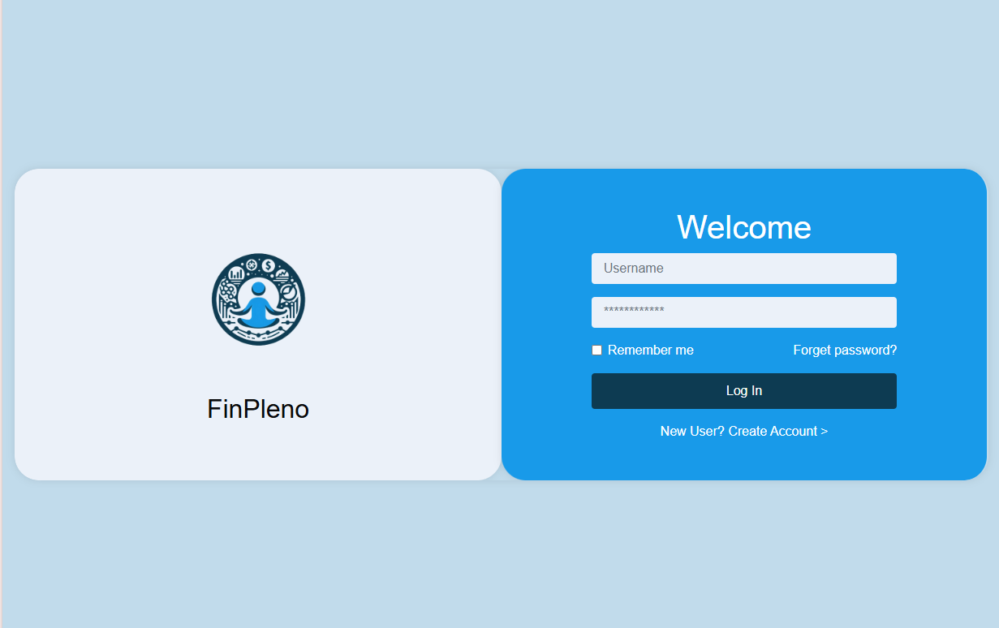

# FinPleno - Aplicação para Controle Financeiro 🚀

Bem-vindo ao FinPleno, este projeto traz um design moderno e uma interface amigável para ajudar você a controlar suas finanças.

## Recursos Incríveis 🌟

- **Design Responsivo:** Nosso login se adapta perfeitamente a qualquer dispositivo, garantindo uma experiência perfeita onde quer que você esteja.
- **Estilo Personalizado:** Usamos Bootstrap para a estrutura e um toque de CSS personalizado (`style.css`) para dar aquele visual único.
- **Organização Visual Clara:** Logotipo, campos do formulário e botões foram pensados para facilitar a navegação e o uso intuitivo.
- **Identidade Visual Forte:** Cores vibrantes e um logotipo que reflete toda a energia do FinPleno.

## Tecnologias Utilizadas 🛠️

- **HTML5:** Estrutura sólida para a página de login.
- **CSS3:** Estilização moderna e responsiva.
- **Bootstrap 4.5.2:** Base sólida para um layout adaptável e consistente.

## Como Começar

1. **Clonar ou Baixar:** Pegue os arquivos do projeto no nosso repositório.
2. **Abrir no Navegador:** Vá até a pasta do projeto e abra o `index.html` para começar.

## Organização do Projeto 📁

- **FinPleno-Login/**
  - **index.html**: O coração da nossa página de login.
  - **style.css**: Toques finais para deixar tudo com a cara do FinPleno.
  - **images/**
    - **fin_pleno_logo.png**: Nosso logo vibrante e cheio de personalidade.

## Nosso Estilo 🎨

- **Paleta de Cores:** Azul tranquilizante (`#189AE9`) para um ar de profissionalismo e confiança.
- **Tipografia:** Fontes modernas para uma leitura fácil e agradável.
- **Elementos do Formulário:** Campos arredondados e botões que dão vontade de clicar.
- **Design Acolhedor:** Seções bem delineadas para uma experiência visualmente agradável.

## O que Vem por Aí? 🚀

- **Validação de Formulários:** Em breve, JavaScript para validar seus dados e garantir tudo certinho.
- **Tratamento de Erros:** Mensagens amigáveis para quando algo não sair como esperado.
- **Recuperação de Senha:** Esqueceu sua senha? Logo teremos uma solução para você!
- **Integração:** Conectaremos tudo com um backend para autenticação segura.
- **Acessibilidade:** Todos são bem-vindos! Garantiremos acessibilidade para todos os usuários.

## Dê uma Olhada! 👀

## Quer Contribuir?

Se você tem ideias para deixar o FinPleno ainda melhor, siga estes passos:

1. Faça um fork do nosso repositório.
2. Crie uma branch com sua ideia (`git checkout -b feature/sua-ideia-aqui`).
3. Faça as alterações e compartilhe (`git commit -am 'Adicionando sua ideia'`).
4. Envie para a branch (`git push origin feature/sua-ideia-aqui`).
5. Abra um pull request e vamos crescer juntos!

Vamos transformar o controle financeiro em algo incrível juntos! 💸✨
